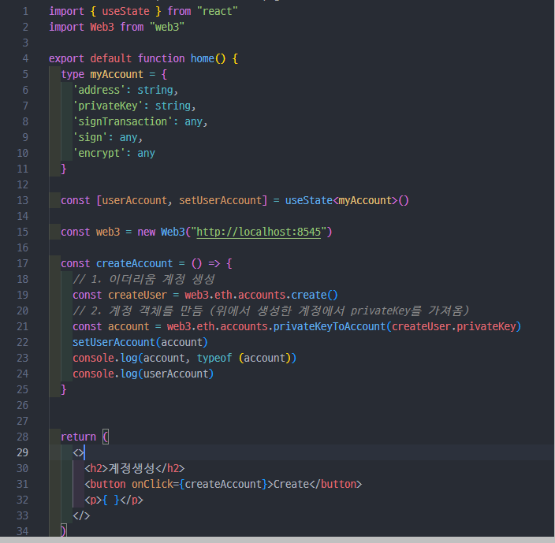
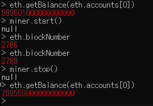
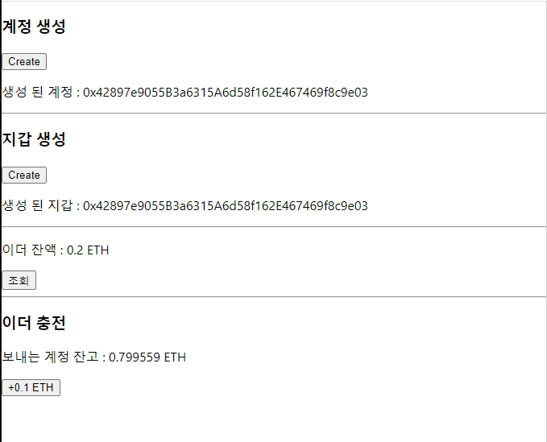

# Next.js & TS 환경설정

## 초기 설정

→ Next.js, TS 초기 설치 (@latest ← 최신 버전 설치)

`npx create create-next-app@latest --typescript`

→ 실행 명령어

`npm run dev`

package.json 확인


Next.js + TypeScrtipt

- typescript 관련 파일들이 설치
- 파일 확장자 명이 .tsx로 생성

파일 구조

```
|-- .next
|-- node_modules
|-- pages
|-- public
|-- styles
|-- .eslintrc.json
|-- next.config.js
|-- .gitignore
|-- package-lock.json
|-- package.json
|-- README.md
```

- .eslintrc.json
  - ESLint 설정 파일
- next.config.js
  - Next.js 프로젝트 설정 파일

## 페이지 생성

1. page 폴더 안의 모든 파일 삭제

2. index.tsx 생성
   
   ```jsx
   export default function home () {
       return 'ts'
   }
   ```

3. next.js 에서 pages 폴더는 라우터의 기능 (파일 이름이 곧 주소 창의 경로)
   
   1. about.tsx
      
      ```jsx
      export default function about () {
          return "about"
      }
      ```
      
       위와 같이 pages폴더 안에 about.tsx 파일을 생성하게 된다면 `http://localhost:3000/about` 로 접근이 가능.

4. 파일 생성 시 export default가 꼭 지정돼야 함 ([https://quark21.tistory.com/314](https://quark21.tistory.com/314))


---

# Req. 1. 지갑 관련 기능 구현

백엔드 스켈레톤 코드 실행 시도

-> 백엔드 코드 구현 불가능으로 현재 내가 로컬에서 가지고 있는 계정으로 테스트



초기 타입스크립트 + 리액트로 구현 하려다 실패 (아마 객체 타입 지정이 문제가 돼서 변수에 객체가 담기지 않는 것 같다..)


이후 자바스크립트로 다시 작성


```javascript
import { useState, React } from "react";
import Web3 from "web3";

function Req1() {
  const [userAccount, setUserAccount] = useState();
  const [userWallet, setUserWallet] = useState();
  const [userBalance, setUserBalance] = useState();
  const [senderBalance, setSenderBalance] = useState();

  const web3 = new Web3("http://localhost:8545");

  const createAccount = () => {
    const createdObj = web3.eth.accounts.create();
    const account = web3.eth.accounts.privateKeyToAccount(
      createdObj.privateKey
    );
    setUserAccount(account);
    console.log(account)
  };

  const createWallet = () => {
    setUserWallet(web3.eth.accounts.wallet.add(userAccount));
  };

  const getWalletBalance = () => {
    web3.eth
      .getBalance(userWallet.address)
      .then((balance) => setUserBalance(web3.utils.fromWei(balance, "ether")));
    web3.eth
      .getBalance("0x89a524c29153042547b52a2ddb442d626176ce43")
      .then((balance) => setSenderBalance(web3.utils.fromWei(balance, "ether")));
  };

  const chargeEth = (price) => {
    const Eth = web3.utils.toWei(String(price), "ether");
    const tx = {
      from: "0x89a524c29153042547b52a2ddb442d626176ce43",
      to: userWallet.address,
      value: Eth,
    };
    web3.eth.sendTransaction(tx).then((receipt) => console.log(receipt));
  };

  return (
    <div>
      <h3>계정 생성</h3>
      <button onClick={createAccount}>Create</button>
      <p>생성 된 계정 : {userAccount ? userAccount.address : null} </p>
      <hr />
      <h3>지갑 생성</h3>
      <button onClick={createWallet}>Create</button>
      <p>생성 된 지갑 : {userWallet ? userWallet.address : null}</p>
      <hr />
      <div>
        <p>이더 잔액 : {userBalance} ETH</p>
        <button onClick={getWalletBalance}>조회</button>
      </div>
      <hr />
      <h3>이더 충전</h3>
      <div>
        <p>보내는 계정 잔고 : {senderBalance} ETH </p>
        <button onClick={() => chargeEth(0.1)}> +0.1 ETH</button>
      </div>
    </div>
  );
}

export default Req1;
```


송금 할 계정 잔액 확인


**송금과정**

- 0.1 이더리움을 보내는 버튼을 클릭 (그 전에 송금자의 계정의 락을 풀어줘야함)
  
  

- 해제 후 송금 버튼을 통해 송금을 시킴
  
  

- 송금 트랜잭션을 위해 마이닝 시작 후 종료, 그리고 잔고 확인
  
  

- 이후 클라이언트에서 잔고 확인
  
  