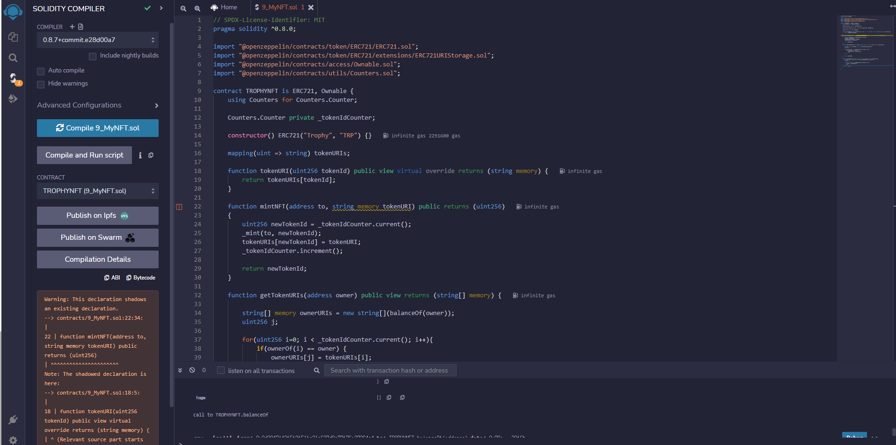
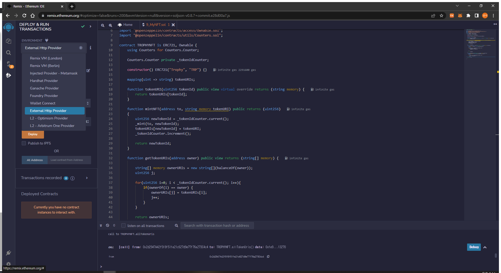

# ERC 721 텍스트로 이미지를 만들고 NFT 배포까지


## 배포 순서

1. AI를 통해 텍스트를 이미지로 변경

2. ERC 721 계약 배포

3. 이미지를 IPFS 서버에 올리기

4. IPFS서버에 올린 이미지 주소를 metadata.json으로 만들어서 IPFS에 올리기

5. 해당 IPFS의 uri로 NFT민팅

6. 이후 거래는 ERC721 표준 참고해서 함수 적절하게 쓰면 가능 (일단 우리는 만들어진 이미지를 전달 하는 것 까지만 진행)

   

## AI를 통해 텍스트로 이미지 만들기

* DeepAI API이용 https://deepai.org/machine-learning-model/text2img 참고 (유..료... 1000건 당 2달러)


* **React에서 사용하는법**

  * deepai 설치

  ```
  npm install --save deepai
  ```

  * 코드작성

  ```javascript
    const Text2Img = async () => {
      const deepai = require("deepai");
  
      deepai.setApiKey("deepai api key");  
  
      var resp = await deepai.callStandardApi("text2img", {
        text: "your text", // 이미지로 바꾸길 원하는 텍스트
      });
  
      const generatedImg = resp.output_url;
    }
  ```

  * 결과
    * ai가 그린 4개의 이미지

  


* 이미지 자르기

  * 4개씩 붙어서나오는 이미지를 Js의 canvas api를 이용해 자르기 (api 문서에서 1개씩만 나오게 하는 건 못찾았음)

  ```javascript
  const canvas = document.createElement("canvas"); // canvas 태그 만들기
  const newImg = new Image(); // 새로운 이미지를 만들고 src로 generatedImg를 넣어줌
  newImg.src = generatedImg;
  newImg.crossOrigin = "Anonmymous"; // crossOrigin 설정
  
  newImg.onload = async () => {                                // 이미지 로드가 완료 되면...
      const ctx = canvas.getContext("2d");                     // 캔버스 설정 (위의 사진은 512*512이므로 한장은 256*256)
      canvas.width = 256;
      canvas.height = 256;
      ctx.drawImage(newImg, 0, 0, 256, 256, 0, 0, 256, 256);   //(이미지, 시작좌표 x, y, 끝좌표x, y, 캔버스 좌표x, y, 끝 좌표 x, y)
      const dataUrl = canvas.toDataURL("image/jpeg");
      console.log(dataUrl);                                    // base64형식으로 출력
  }
  ```

  * 결과

  


* DataURL 형식으로 나온 이미지를 file 형식으로 변경 (추후 IPFS에 업로드 하기 위함)

  * DataURL => Blob

  ```javascript
  const dataurlToBlob = (url) => {
    const byteString = atob(url.split(",")[1]);
    const mimeString = url.split(",")[0].split(":")[1].split(";")[0];
    const ab = new ArrayBuffer(byteString.length);
    const ia = new Uint8Array(ab);
    for (let i = 0; i < byteString.length; i += 1) {
      ia[i] = byteString.charCodeAt(i);
    }
    return new Blob([ab], { type: mimeString });
  };
  ```

  * 파일 형식으로 만들기

  ```javascript
  const newFile = new File([dataurlToBlob(dataUrl)], v1()); //dataUrl > Blob으로 변경 후 파일로 만듬, uuid를 통한 랜덤한 파일명 v1()
  ```

  


## ERC 721 계약 배포 (로컬넷)

* 계약 배포는 Remix 이용

* **솔리디티 코드 예제**

  * openzeppelin의 ERC721 상속

  * 추가 기능 구현

  * 필수 함수 설명은 openzeppelin github 참조 

    https://github.com/OpenZeppelin/openzeppelin-contracts/blob/master/contracts/token/ERC721/ERC721.sol

```solidity
// SPDX-License-Identifier: MIT
pragma solidity ^0.8.0;

import "@openzeppelin/contracts/token/ERC721/ERC721.sol";
import "@openzeppelin/contracts/token/ERC721/extensions/ERC721URIStorage.sol";
import "@openzeppelin/contracts/access/Ownable.sol";
import "@openzeppelin/contracts/utils/Counters.sol";

contract TROPHYNFT is ERC721, Ownable {
    using Counters for Counters.Counter;

    Counters.Counter private _tokenIdCounter;

    constructor() ERC721("Trophy", "TRP") {}

    mapping(uint => string) tokenURIs;

    function tokenURI(uint256 tokenId) public view virtual override returns (string memory) {
        return tokenURIs[tokenId];
    }

    function mintNFT(address to, string memory tokenURI) public returns (uint256)
    {
        uint256 newTokenId = _tokenIdCounter.current();
        _mint(to, newTokenId);
        tokenURIs[newTokenId] = tokenURI;
        _tokenIdCounter.increment();
        
        return newTokenId;
    }
	
	
	// 파라미터로 넘긴 주소의 토큰 uri를 배열로 반환
    function getTokenURIs(address owner) public view returns (string[] memory) {
        
        string[] memory ownerURIs = new string[](balanceOf(owner));
        uint256 j;

        for(uint256 i=0; i < _tokenIdCounter.current(); i++){
            if(ownerOf(i) == owner) {
                ownerURIs[j] = tokenURIs[i];
                j++;
            }
        }

        return ownerURIs;
    }

	// 모든 토큰 uri를 반환
    function allTokenUris() public view returns (string[] memory) {
        string[] memory uris = new string[](_tokenIdCounter.current());
        uint256 j;

        for (uint i = 0; i < _tokenIdCounter.current(); i++){
            uris[j] = tokenURIs[i];
            j++;
        }
        return  uris;
    } 

}
```

* **컴파일**
  * warnning 메세지 뜨는데 무시해도 될듯?
  * 혹시 안되면 컴파일러 버전 맞춰주기



* **배포단계에서 로컬넷 설정 후 배포 (로컬넷 구동, 채굴 까지 진행중이여야함)**




## React에서 NFT 배포하기

* **로컬에 배포 된 계약 가져오기**

```javascript
import Web3 from "web3";

const web3 = new Web3("http://localhost:8545");

const CA = "contract address"    // 배포 후 CA 
const ABI = "json~~"             // remix로 컴파일하면 하단에 abi 주소 복사하기

const contract = new web3.eth.Contract(ABI, CA);   // web3 api로 계약 가져오기
```


* **IPFS에 이미지 업로드**
  * 로컬에서 직접 IPFS를 구현하는 것도 가능 (NFT 명세에 나와있음)
  * 우린 Pinata 사용해서 구현 https://www.pinata.cloud/

```javascript
import axios from "axios";
import Web3 from "web3";

export const sendFileToIPFS = async (file) => {             // 위에서 만들어둔 file 형식을 파라미터로 넣어주기!
  const web3 = new Web3("http://localhost:8545");
  
  try {
    const formData = new FormData();
    formData.append("file", file);
    const resFile = await axios({
      method: "post",
      url: "https://api.pinata.cloud/pinning/pinFileToIPFS",
      data: formData,
      headers: {
        pinata_api_key: "pinata_api_key",
        pinata_secret_api_key:
          "pinata_secret_api_key",
        "Content-Type": "multipart/form-data",
      },
    });

    var ImgHash = `ipfs://${resFile.data.IpfsHash}`;            // NFT 민팅시 메타데이터에 넣어줄 이미지 주소
    console.log(ImgHash);
  } catch (error) {
    console.log("Error sending File to IPFS: ");
    console.log(error);
  }
```


* **IPFS에 메타데이터 업로드** 

  * 메타데이터 기본
  * 추가로 속성 정의 가능함 

  ```
  {
    "description": "Description of your NFT", 
    "image": "ipfs://YOUR_ASSET_CID", 
    "name": "A name for your NFT"
  }
  ```

  * pinata api를 통해 메타데이터 업로드

  ```javascript
    const data = JSON.stringify({
      description: "maybe upload trophy",                  // NFT 설명
      image: ImgHash,                                      // IPFS에 올린 이미지 주소 
      name: "TestNFT",                                     // NFT 이름
    });
  
    const config = {
      method: "post",
      url: "https://api.pinata.cloud/pinning/pinJSONToIPFS",
      headers: {
        "Content-Type": "application/json",
        pinata_api_key: "pinata_api_key",
        pinata_secret_api_key:
          "pinata_secret_api_key",
      },
      data: data,
    };
  
    const res = await axios(config);
    const ipfsHash = res.IpfsHash                          // 민팅할 tokenURI 완성
  ```


* **민팅 하기**
  * 스마트 컨트랙트의 mintNFT 활용

```javascript
const contract = new web3.eth.Contract(ABI, CA);  
contract.methods
  .mintNFT(serverWalletAddress, `ipfs://${res.IpfsHash}`)
  .send({ from: serverWalletAddress })
  .then((res) => console.log(res));
```


* **TokenUri로 NFT 데이터 조회**

```javascript
  const NFT = async () => {
    const data = await fetch(
      `https://gateway.pinata.cloud/ipfs/${cid}`
    );

    const json = await data.json();
    console.log(json);
  };

> response
{
  "description": "Description of your NFT", 
  "image": "ipfs://YOUR_ASSET_CID", 
  "name": "A name for your NFT"
}
```


